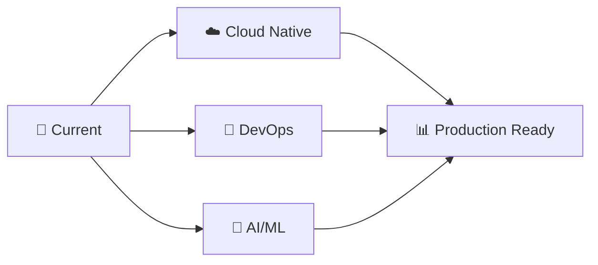

<div align="center">

# 🚀 Vitalii Stuken | Software Alchemist 🧙‍♂️


### 💫 Passionate about turning ☕ into code and ideas into reality

---

</div>

## 🎯 About Me

```yaml
name: Vitalii Stuken
location: "Somewhere in the digital realm 🌐"
current_focus: "Building scalable backend systems"
philosophy: "Code is poetry written in logic"
superpower: "Debugging at 3 AM with a smile 😄"
weakness: "Can't resist refactoring legacy code"
```

## 🚀 What I'm up to

🔭 **Currently Working On:** Building microservices that scale like magic  
🌱 **Learning:** Advanced Kafka patterns and cloud-native architectures  
🎯 **Goal for 2024:** Contribute to 10 open-source projects  
⚡ **Fun Fact:** I debug faster with rubber duck debugging 🦆  

## 💻 Tech Arsenal

### **Languages & Frameworks**
 
 
 
 


### **Backend & Infrastructure**
 
 


### **Databases & Tools**
 
 


### **Monitoring & Security**
 


## 🎨 Current Learning Journey

```javascript
const currentlyLearning = {
    cloudArchitecture: ["AWS", "Kubernetes", "Microservices"],
    distributedSystems: ["Apache Kafka", "Event Sourcing", "CQRS"],
    devOps: ["CI/CD", "Infrastructure as Code", "Monitoring"],
    softSkills: ["System Design", "Technical Leadership"]
};

console.log("Growth mindset: Always learning! 🚀");
```

<div align="center">

### 🎯 2024 Learning Roadmap



</div>

## 🌟 Featured Projects

<div align="center">

| 🔥 **Project Alpha** | ⚡ **Data Pipeline** | 🛡️ **Auth Service** |
|:---:|:---:|:---:|
| Scalable microservices<br>architecture with Kafka | Real-time data processing<br>and analytics | JWT-based authentication<br>microservice |
|    |   |   |
| 🚀 **[View Demo](#)** | 📊 **[Live Stats](#)** | 🔐 **[API Docs](#)** |

</div>

## ⌛ Coding Activity & Stats

<div align="center">


<br><br>

<!-- Activity Graph -->


</div>

<details>
<summary>📊 GitHub Analytics Dashboard</summary>

<div align="center">

### 📈 Performance Metrics

<br/>

### 🔥 Contribution Streak

<br/>

### 🗣️ Most Used Languages


### ⏰ Development Breakdown

<!--START_SECTION:waka-->
<!--END_SECTION:waka-->

</div>

</details>

## 🏆 Achievement Showcase

<div align="center">


<br>

<!-- Snake Animation -->
<picture>
  <source media="(prefers-color-scheme: dark)" srcset="https://raw.githubusercontent.com/stukenvitalii/stukenvitalii/output/github-contribution-grid-snake-dark.svg">
  <source media="(prefers-color-scheme: light)" srcset="https://raw.githubusercontent.com/stukenvitalii/stukenvitalii/output/github-contribution-grid-snake.svg">
  
</picture>

</div>

## 🎭 Beyond Code

When I'm not crafting code, you'll find me:

- 📚 Reading tech blogs and architecture patterns
- 🎮 Gaming (strategy games are my weakness!)
- 🏃‍♂️ Running and staying active
- 🎵 Listening to electronic music while coding
- 🌱 Learning new programming languages

<div align="center">

### 💡 Random Dev Wisdom


</div>

## 🤝 Let's Connect!

<div align="center">

[](https://linkedin.com/in/yourprofile)
[](https://twitter.com/yourhandle)
[](mailto:your.email@example.com)
[](https://yourportfolio.com)

---

💭 *"The best way to predict the future is to invent it."* - Alan Kay

[](https://visitcount.itsvg.in)

</div>

<!-- Creatively crafted with passion by Vitalii Stuken -->